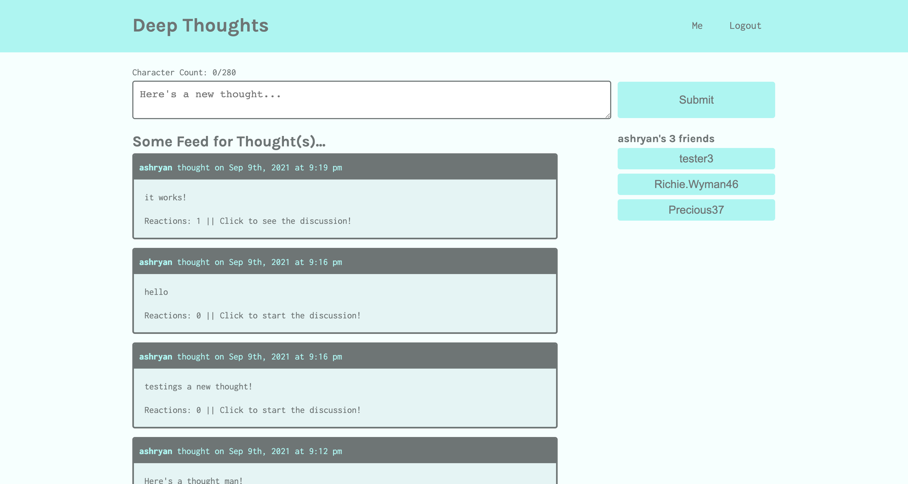

# Deep Thoughts

## Description
A social media application called Deep Thoughts. Users will be able to sign up and create an account, post their thoughts, interact with other users, and create a friend's list

---

## Table of Contents
* [Built With](#built-with)
* [See It For Yourself](#screenshots)

---

## Built With
* MERN
    - MongoDB
    - Express
    - React
    - NodeJS
* GraphQL
* Apollo Server
* React Router
* concurrently npm package
* JWTs (JSON Web Tokens)
* jwt-decode npm package
* faker npm package

---

## Screenshots
